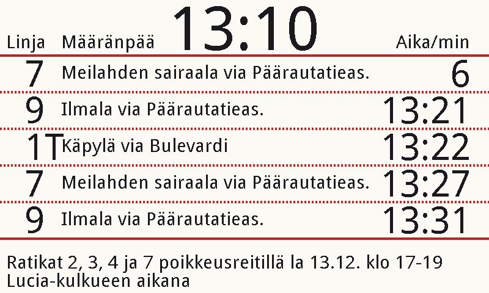
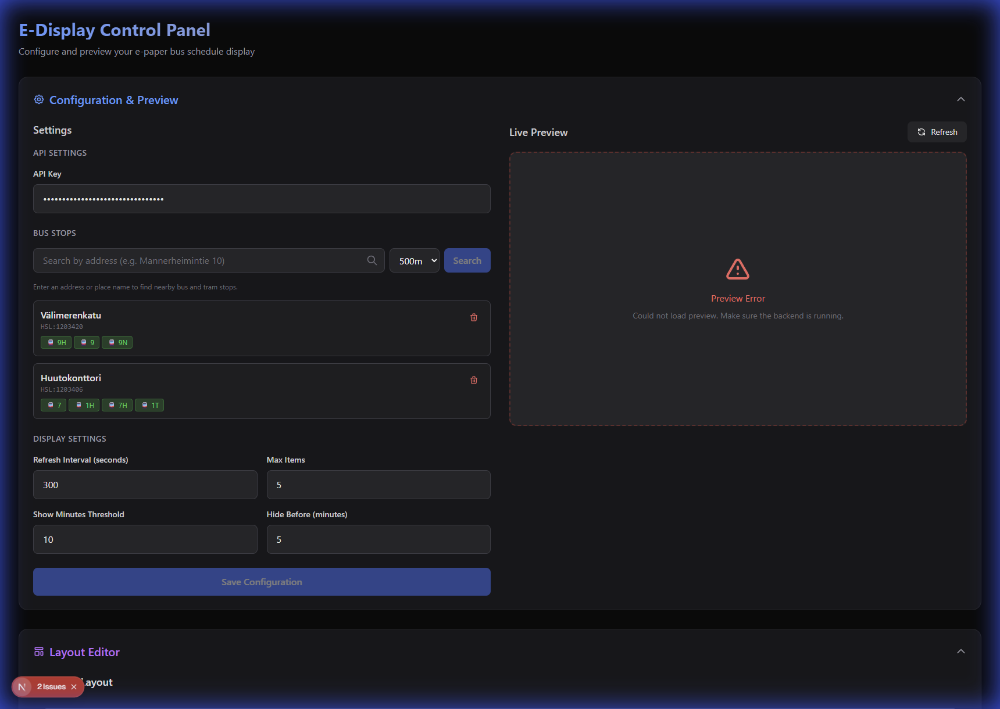
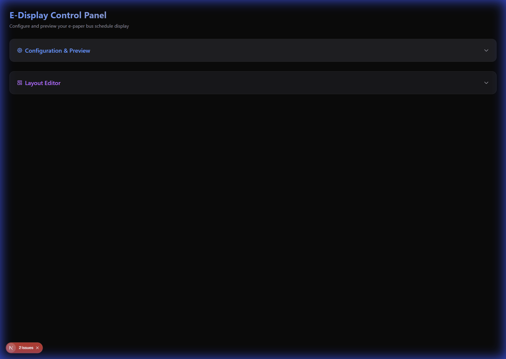

# E-Display

**E-Display** is a smart, e-ink public transport display for Helsinki Regional Transport (HSL) data. It is designed to run on a Raspberry Pi connected to a Waveshare 7.5" E-Ink display (Black/White/Red).

The project consists of two main components:
1.  **Backend**: A Python application that fetches data from the HSL API, renders the schedule, and updates the e-ink display. It also provides a REST API for configuration.
2.  **Web UI**: A modern Next.js web application for configuring stops, customizing the layout, and previewing what the display will look like in real-time.

## Features

-   **Real-time Departures**: Shows upcoming bus/tram/train departures for configured stops.
-   **E-Ink Support**: Optimized for Waveshare 7.5" E-Ink displays (supports 3-color rendering).
-   **Web Configuration**: Easy-to-use web interface to search for stops and manage settings.
-   **Live Preview**: visual editor to adjust the layout and see how it will look on the actual screen.
-   **Visual Layout Editor**: Drag-and-drop or slider-based adjustments for all display elements.
-   **Alerts**: Displays disruption alerts from HSL.
-   **Dockerized**: Easy deployment using Docker Compose.

## Screenshots

### E-Ink Display Preview

*Real-time departure view generated for the 7.5" E-Ink Display*

### Web Configuration UI

*Modern dashboard for managing stops and settings*

### Visual Layout Editor

*Drag-and-drop layout editor for customizing the display*

## Hardware Requirements

-   **Raspberry Pi** (Zero W, 3, or 4 recommended).
-   **Waveshare 7.5" E-Paper Display (B)** (Black/White/Red) or compatible.
-   **MicroSD Card** for the OS.

## Quick Start (Docker)

The easiest way to run E-Display is using Docker.

1.  **Clone the repository:**
    ```bash
    git clone https://github.com/Saavuori/E-Display.git
    cd E-Display
    ```

2.  **Configure API Key:**
    You need an API key from the [Digitransit](https://portal-api.digitransit.fi/).
    Create a `.env` file in the root directory:
    ```bash
    HSL_API_KEY=your_hsl_api_key_here
    ```

3.  **Run with Docker Compose:**
    ```bash
    docker-compose up -d
    ```

    This will start:
    -   **Backend API** on port `8000`.
    -   **Web UI** on port `3000`.
    -   **Display Driver** (runs the e-ink screen).

4.  **Access the Web UI:**
    Open `http://<your-pi-ip>:3000` in your browser to configure your stops and layout.

## Development Setup

### Backend (Python)

1.  Create a virtual environment:
    ```bash
    python -m venv venv
    source venv/bin/activate  # On Windows: venv\Scripts\activate
    ```

2.  Install dependencies:
    ```bash
    pip install -r requirements.txt
    ```

3.  Run the API server:
    ```bash
    python api.py
    ```
    The API will be available at `http://localhost:8000`.

4.  Run the Display script (standalone):
    ```bash
    python display.py
    ```
    *Note: On non-Raspberry Pi systems, this will run in "Mock Mode" and generate a preview image instead of driving hardware.*

### Frontend (Next.js)

1.  Navigate to the web-ui directory:
    ```bash
    cd web-ui
    ```

2.  Install dependencies:
    ```bash
    npm install
    ```

3.  Run the development server:
    ```bash
    npm run dev
    ```
    The UI will be available at `http://localhost:3000`.

## Configuration

Configuration is stored in `config.json` in the root directory. You can edit this file manually or use the Web UI.

**Example `config.json`:**
```json
{
    "hsl_api_url": "https://api.digitransit.fi/routing/v2/hsl/gtfs/v1",
    "hsl_api_key": "YOUR_API_KEY",
    "stops": [
        {
            "id": "HSL:123456",
            "name": "My Stop",
            "routes": null
        }
    ],
    "refresh_interval_seconds": 300,
    "display": {
        "max_items": 5,
        "show_arrival_minutes_threshold": 10,
        "hide_arrival_before_minutes": 0
    },
    "layout": {
        "top_line_y": 90,
        "line_gap": 60,
        "clock_x": 400,
        "clock_y": 10,
        ...
    }
}
```

## License

[MIT](LICENSE)